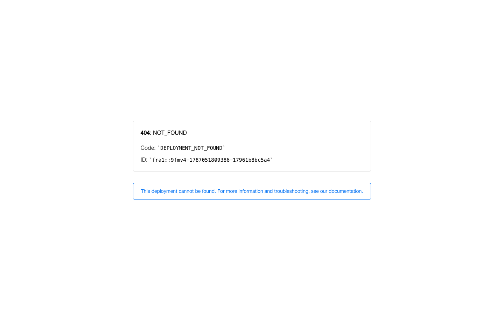

# Wayfare

Wayfare is a map-first travel planner for building self-guided trips. It brings saved places, daily schedules, flights, stays, and expenses into one responsive trip workspace.

**Live site:** [wayfare-one-wine.vercel.app](https://wayfare-one-wine.vercel.app)

## Highlights

- Create trips and organise each day on an itinerary.
- Save places and schedule them more than once without duplicating the source place.
- Manage stays, flights, and trip expenses.
- Use Supabase authentication and persistence, Google Maps/Places search, and AeroDataBox flight data.

## Screenshots

| Desktop | Detail | Mobile |
| --- | --- | --- |
|  |  |  |

## Run locally

### Prerequisites

- Node.js 20+
- A Supabase project
- Google Maps Platform credentials
- A RapidAPI key for AeroDataBox if you want flight search

~~~bash
npm install
cp .env.example .env.local
npm run dev
~~~

Open http://localhost:3000. Populate the variables named in .env.example, then apply the Supabase migrations in supabase/migrations.

## Scripts

~~~bash
npm run dev
npm run lint
npm run typecheck
npm run build
~~~
